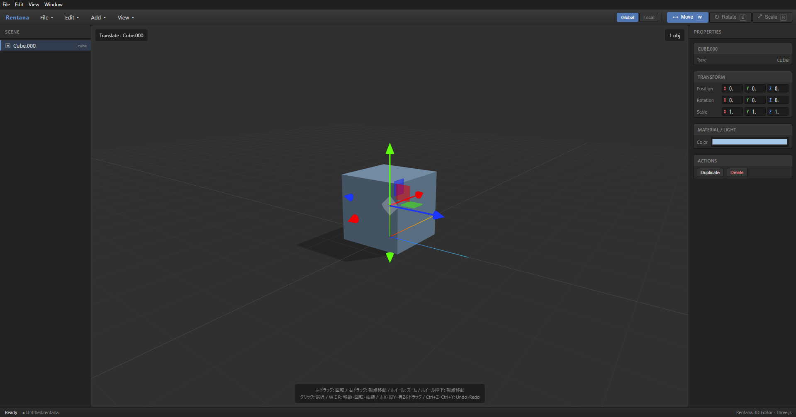

# Rentana



A simple Three.js-based 3D modeling editor that runs in the browser and Electron. It offers Unity-like controls, letting you move, rotate, and scale objects via gizmos.

## Main Features

- Add Cube, Sphere, Cylinder, Cone, Torus, Plane, and Point Light
- Mouse interaction via X/Y/Z axis gizmos
- Blender-style Edit Mode with vertex selection and transformation
- In-editor UV projection and texture painting
- Alt + left-drag vertex area selection
- Numeric editing of Position, Rotation, and Scale
- Toggle between Global (world) and Local coordinate spaces
- Shift-based snapping (move 0.25, rotate 15 degrees, scale 0.25)
- Save and load projects in the `.rentana` format
- FBX export with embedded and external textures
- GLB/GLTF export
- Image textures on mesh materials (PNG, JPEG, BMP, GIF, WebP)
- Undo/Redo (up to 100 entries)
- Download-based saving in the browser version and native file dialogs in the Electron version


## Setup

```bash
npm install
```

## Running

### Browser Version

```bash
npm run dev
```

Open the Vite URL (typically `http://localhost:5173`) shown in the terminal in your browser.

### Electron Version

```bash
npm run electron:dev
```

The Electron version lets you save and load `.rentana` files as well as GLB/GLTF via native save and open dialogs.

## Basic Usage

1. Add an object from the `Add` menu.
2. Select an object from the scene hierarchy or the 3D view.
3. Choose `Move`, `Rotate`, or `Scale` and drag a gizmo axis.
4. You can enter Position, Rotation, and Scale directly in the Inspector on the right.
5. Save as a `.rentana` file via `File > Save Project`.

To add an image texture, select a mesh and click `画像を選択…` in
`Properties > Material / Light`. Texture images are embedded in `.rentana`
project files so they are restored when the project is reopened.

To create or paint a texture in Rentana, click `Texture Paint / UV…` in the
same panel. The editor displays the mesh UVs over a paint canvas and supports:

- Box, top/bottom, front/back, and side UV projections
- 256–2048 pixel texture creation
- Brush and eraser tools with adjustable color and size
- Live material preview in the 3D viewport
- PNG persistence in the project and texture-aware FBX/GLB export

Press `Tab` with a mesh selected to enter Edit Mode. Click a vertex to select it, use `Shift+Click` for multi-selection, then move, rotate, or scale the selected vertices with the same gizmos.

### Viewport Controls

| Action | Behavior |
| --- | --- |
| Left drag | Rotate camera |
| Right drag | Pan camera |
| Wheel | Zoom |
| Middle-button drag | Pan camera |
| Click | Select object |
| `Alt` + left click/drag | Select nearby vertices / rectangle-select vertices in Edit Mode |
| Double-click | Focus on selected object |

### Keyboard Shortcuts

| Key | Behavior |
| --- | --- |
| `W` / `G` | Move |
| `E` | Rotate |
| `R` / `S` | Scale |
| `Tab` | Toggle Object Mode / Edit Mode |
| `A` / `Alt+A` | Select all / Deselect all vertices in Edit Mode |
| `Alt` + left drag | Area-select vertices in Edit Mode |
| `X`, `Y`, `Z` | Show only the corresponding axis |
| `Esc` | Clear axis restriction / Deselect |
| `Shift` | Temporarily enable snapping |
| `F` | Focus on the selected object |
| `Delete` / `Backspace` | Delete the selected object |
| `Ctrl+Z` | Undo |
| `Ctrl+Y` / `Ctrl+Shift+Z` | Redo |
| `Ctrl+N` | New project |
| `Ctrl+O` | Open project |
| `Ctrl+S` | Save |
| `Ctrl+Shift+S` | Save As |

## The `.rentana` Format

`.rentana` is Rentana's proprietary JSON-based project format. It stores the following information:

- Object type, name, and order
- Position, Rotation, and Scale
- Material color, roughness, metalness, and opacity
- Diffuse texture name, MIME type, and embedded image data
- Edited UV coordinates
- Point Light color, intensity, distance, and decay
- Camera position, target, and FOV
- Transform mode, coordinate space, and selection state

In the browser version, saving downloads a `.rentana` file. In the Electron version, you can choose where to save it.

## GLB/GLTF Export

From the `File` menu you can export the entire scene or the currently selected object(s) as GLB/GLTF. Helper gizmos and light display helpers are excluded from the export.

## FBX Export

Use `File > Export FBX…` to export the scene, or
`File > Export Selected (FBX)…` to export the selected object. Rentana writes
ASCII FBX 7.4 with mesh geometry, normals, UVs, transforms, materials, point
lights, and diffuse textures.

In Electron, texture images are written to a `textures/` folder beside the FBX
file and referenced with relative paths. They are also embedded in the FBX for
portability. In the browser, the FBX and the original texture images are
downloaded separately, while the embedded copy keeps the FBX usable by itself.

## Development Commands

```bash
npm run dev          # Vite dev server
npm run build        # Production build to dist/
npm run preview      # Preview the production build
npm run electron:dev # Vite + Electron dev launch
npm run electron:build # Build for Electron distribution
npm start            # Launch Electron using dist/
```

## Tech Stack

- Three.js: 3D scene, rendering, TransformControls, GLTFExporter
- Vite: Frontend dev server and build
- Electron: Desktop app and native file I/O
- `electron/preload.cjs`: Secure bridge between the renderer and Electron IPC

## License

MIT License
